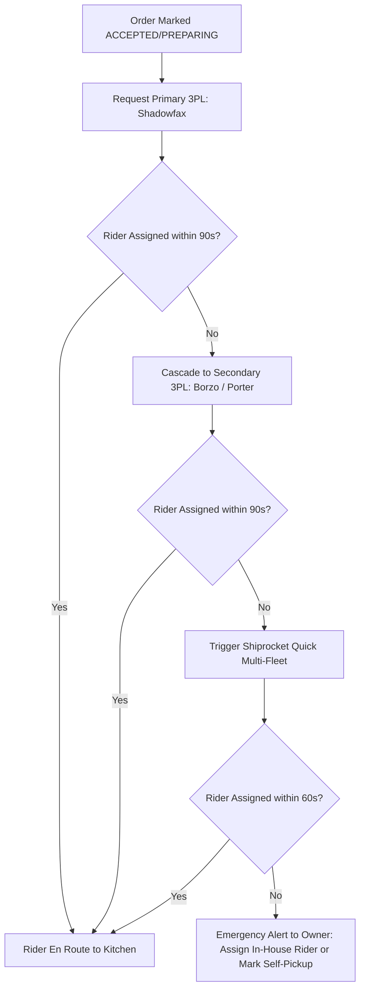

# 🛵 Delivery Logistics & 3PL Strategy

## 1. The 3PL Ecosystem in India (2026)

Hyperlocal food logistics require low latency and high rider density. The platform integrates with multiple 3PL APIs:

| Provider | Core Strength | Integration Type | Best Use Case |
| :--- | :--- | :--- | :--- |
| **Shadowfax Hyperlocal** | Dedicated food delivery fleet, hot bags, OTP tracking | Direct REST API / Webhooks | Primary food delivery partner |
| **Borzo (ex-WeFast)** | High rider density across NCR, rapid turnaround | REST API | Peak surge overflow & backup |
| **Porter Hyperlocal** | Two-wheeler city courier fleet | REST API | Multi-point pickups & long-distance |
| **Shiprocket Quick** | Aggregator of logistics partners (Borzo, Porter, etc.) | Single Unified API | Universal fallback layer |
| **ONDC Logistics** | Auto-assigned open network riders (Dunzo, LoadShare, etc.) | ONDC Protocol | ONDC-routed orders |

---

## 2. Multi-Provider Dispatch Waterfall

To eliminate the common failure mode (Saturday 8:30 PM dinner rush rider shortages), the system utilizes an automated fallback waterfall:

---

## 3. Real-World Unit Economics & Delivery Fee Strategy

- **Typical 3PL Delivery Cost**: ₹40 – ₹80 for 0–5 km (subject to rain/peak surge).
- **Pricing Policy Matrix**:
  - **Orders < ₹299**: Customer pays standard delivery charge (₹40–₹50).
  - **Orders ₹300 – ₹599**: Subsidized delivery (Customer pays ₹25, Restaurant absorbs ₹20).
  - **Orders ≥ ₹600**: Free delivery for customer (Absorbed by high order basket margin).
- **COD (Cash on Delivery) Protocol**:
  - Phase 1 launches strictly **Prepaid (UPI & Cards)** to eliminate 3PL cash remittance cycles and COD disputes.
  - Phase 2 introduces COD with 3PL cash collection once daily order volume stabilizes.
