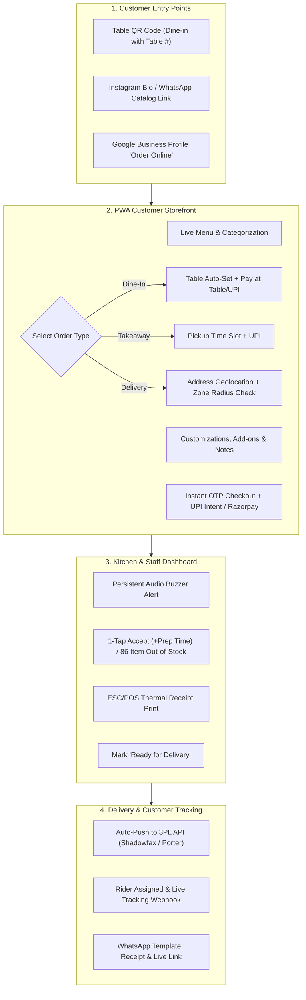

# 📱 MVP & Customer Ordering App Specification ("Restobite-in-a-Box")

## 1. MVP Scope & Philosophy

For a single small restaurant or cloud kitchen, the MVP focuses strictly on the core transaction loop. Avoid bloated multi-branch SaaS complexity in v1.

---

## 2. The Customer Ordering App: Deep-Dive

The customer ordering app is the restaurant's digital storefront. It must feel as fast, responsive, and trustworthy as Swiggy/Zomato, without the marketplace branding or commission.

### How Customers Access the Storefront:
1. **Zero App Store Friction**: No mandatory app downloads. Native PWA architecture allows returning loyalists to "Add to Home Screen" with an app icon, offline menu caching, and instant launch.
2. **Table QR Codes**: Auto-detects table number directly from query parameter (e.g. `order.restaurant.com/?table=T4`) and pre-selects Dine-in mode.
3. **Social & Search Links**: Direct link in Instagram bio, WhatsApp catalog, and Google Business Profile.

### The 5-Step Customer Flow:
1. **Live Menu Experience**:
   - Organized by intuitive categories (Starters, Main Course, Combos, Beverages, Desserts).
   - High-res food imagery with clear **Veg (🟢) / Non-Veg (🔴) / Vegan (🌱)** badges.
   - Real-time stock sync: Items marked out-of-stock in the kitchen are instantly disabled without page reload.
2. **Order Type Selection**:
   - **Dine-In**: Table auto-locked; option to pay online immediately or request "Pay at Counter / Cash".
   - **Takeaway / Pickup**: Select estimated pickup slot (+15m, +30m).
   - **Home Delivery**: Automatic geolocation pin drop + delivery radius & fee computation.
3. **Cart & Customization**:
   - Item variants (e.g. Half / Full, Regular / Large).
   - Add-on groups (Extra cheese, spicy dip, beverage choice).
   - Preparation notes for the chef ("Less spicy", "No onions").
4. **Frictionless Checkout**:
   - Lightweight Phone Number + OTP verification (no bulky password registration).
   - Native Indian payment rails: **UPI Intent** (GPay, PhonePe, Paytm, Cred), Debit/Credit Cards, Netbanking via Razorpay/Cashfree.
5. **Live Order Tracker & WhatsApp Confirmation**:
   - Real-time visual progress bar: `Received` → `Preparing` → `Ready` → `Out for Delivery` → `Delivered`.
   - Automated WhatsApp message with PDF receipt and live rider tracking link.

---

## 3. Delivery Integration Strategy: The 3 Paths

| Path | Description | Pros | Cons | Recommendation |
| :--- | :--- | :--- | :--- | :--- |
| **1. Aggregator 3PL API** *(Shadowfax / Porter / Pidge / Shiprocket Quick)* | API triggers rider dispatch automatically when kitchen taps "Ready". | Zero fleet management, pay strictly per delivery, scales instantly. | Per-delivery fee (₹40–80) and peak surge rates. | **✅ Recommended for MVP & single restaurant launch.** |
| **2. In-House Fleet** | Restaurant uses its own staff delivery boys. | Zero 3PL commissions, direct control of customer service. | High fixed monthly salary overhead and idle rider cost during off-hours. | Useful only for mature restaurants with existing full-time delivery staff. |
| **3. Hybrid Fallback** | In-house riders handle near deliveries (<2km); 3PL aggregator API handles peak rushes and far orders. | Maximum margin optimization and operational resilience. | Requires multi-fleet routing logic and real-time rider status management. | Ideal for Phase 2 once order volume exceeds 30+ deliveries/day. |

---

## 4. Key Engineering Decisions Made Early

1. **Guest Checkout with Phone OTP**:
   - Allows frictionless first order while capturing phone numbers for order history, automated tracking, and WhatsApp retention campaigns.
2. **Real-time Geofenced Delivery Zones**:
   - Validates customer coordinates against restaurant's polygon or radial delivery zone before checkout to eliminate unserviceable orders.
3. **Synchronized 86 / Availability Toggle**:
   - Kitchen staff can toggle item availability with 1 tap ("Paneer Khatam"), propagating instantly to all active customer sessions via SSE/WebSocket.
