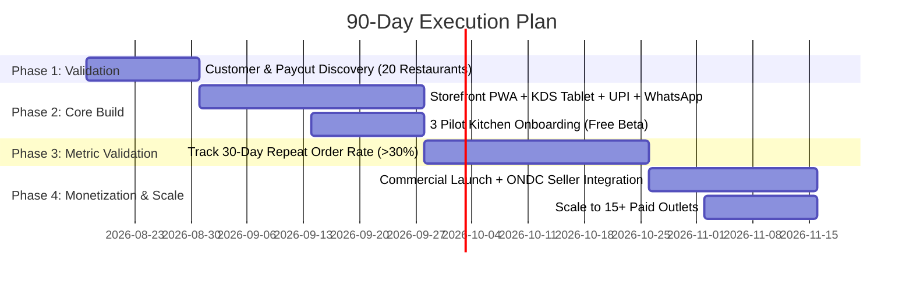

# 🗓️ 90-Day Execution Roadmap

---

## Phase 1 (Weeks 1–2): Discovery & Validation (Do Not Build First)
- **Goal**: Validate pain and willingness-to-pay with real data in one local Delhi neighborhood.
- **Actions**:
  1. Walk into 20 local restaurants / cloud kitchens / bakeries.
  2. Ask 3 core questions:
     - *"What effective percentage do you actually lose to Swiggy/Zomato after ads and GST?"*
     - *"Do you currently have a direct ordering link on your Google Business Profile or WhatsApp?"*
     - *"If we set up your branded ordering system and managed your menu, would you pay ₹1,500–₹2,000/month?"*
  3. Review at least 5 real Swiggy/Zomato monthly payout statements with owners.
- **Success Gate**: At least 5 owners agree to pilot the platform.

---

## Phase 2 (Weeks 3–6): Build the Thinnest Core System
- **Goal**: Ship the minimal viable multi-tenant ordering loop.
- **Deliverables**:
  1. **Mobile Storefront PWA**: Clean menu, modifiers/variants, instant OTP, UPI Intent checkout.
  2. **Kitchen Display System (KDS)**: Web-based tablet view with loud looping audio alarm, 1-tap accept (+prep time), and "Item Out of Stock" toggle.
  3. **Receipt Printing**: WebUSB / Bluetooth ESC/POS receipt generation (58mm/80mm).
  4. **WhatsApp Automation**: Instant order confirmation & live tracking link sent to customer phone.
  5. **1 Integrated 3PL**: Shadowfax or Borzo API auto-dispatch.
- **Success Gate**: 3 pilot restaurants live taking real orders.

---

## Phase 3 (Weeks 7–10): Prove the Single Critical Metric (Retention)
- **Goal**: Prove repeat ordering behavior.
- **Critical Metric**: **30%+ 30-day customer repeat rate** on direct ordering.
- **Tactics**:
  - Distribute physical bag flyer cards with 15% discount on direct orders.
  - Set up Google Business Profile "Order Online" links.
  - Automated WhatsApp reorder nudges 4 days after first order.
- **Success Gate**: If repeat rate is < 30%, optimize the discount incentive and WhatsApp reorder copy before expanding sales.

---

## Phase 4 (Weeks 11–13): Monetization, ONDC & Local Scale
- **Goal**: Transition to paid billing and scale to 15+ outlets.
- **Deliverables**:
  1. Introduce billing tier (₹999/mo + 2.5% GMV or ₹7/order).
  2. Integrate ONDC Seller Protocol to funnel open network discovery into the same KDS dashboard.
  3. Film video testimonials of the 3 pilot owners showing their commission savings.
  4. Expand outreach across neighboring food clusters.
