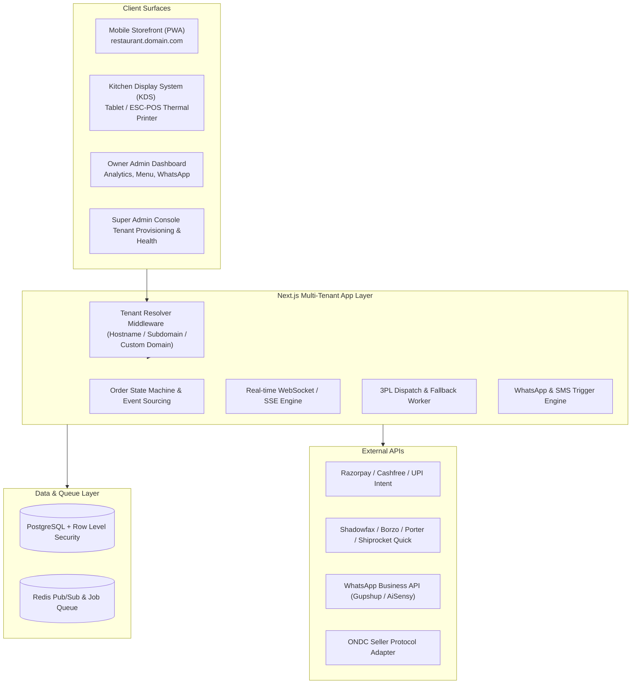
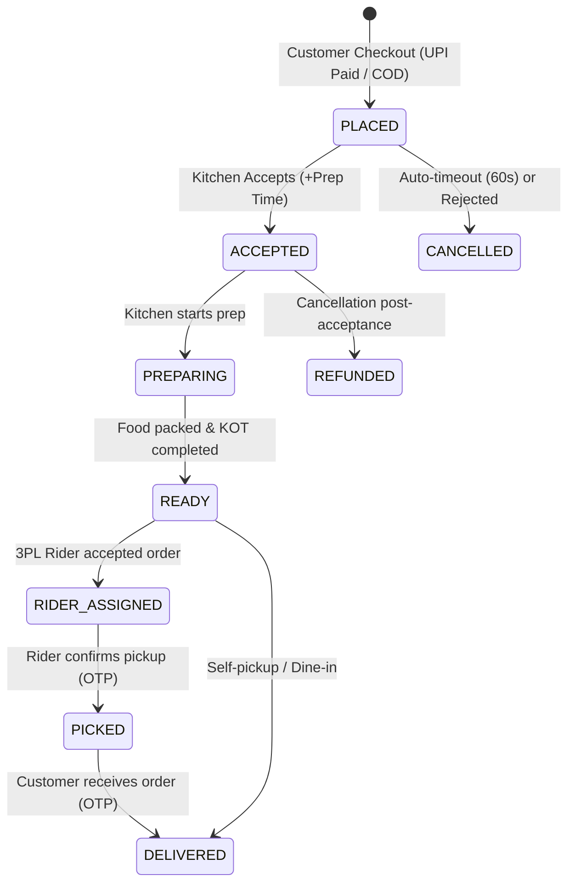

# ⚙️ Technical Architecture & Engineering Blueprint

## 1. System Overview & Multi-Tenancy

The platform is designed as a single multi-tenant Next.js application backed by PostgreSQL with Row-Level Security (RLS). A single deployment serves all vertical formats (cloud kitchen, QSR, tiffin, bakery).

---

## 2. The Four Primary Surfaces

1. **Customer Storefront (PWA)**:
   - Mobile-first, sub-2s load time.
   - Dynamic branding, color scheme, and banner per `tenant_id`.
   - UPI Intent checkout (`gpay://`, `phonepe://`, `paytm://`) + Instant OTP login.
   - Address pin drop with Geolocation API + Delivery zone validation.

2. **Kitchen Display System (KDS) & Order Dashboard**:
   - High-contrast visual cards for dim or harsh kitchen lighting.
   - **Audible Buzzer Alert**: Continuous audio chime until acknowledged.
   - **One-Tap Actions**: Accept (+10m, +20m, +30m prep time), Mark Ready, Call Rider.
   - **Thermal Printer Bridge**: Automatic ESC/POS printing on 58mm/80mm thermal receipt printers over WebUSB, Network IP, or Bluetooth.
   - **Item Availability Toggle ("Paneer Khatam")**: 1-click toggle to disable out-of-stock items immediately.

3. **Owner Dashboard**:
   - Menu engineering (categories, variants, add-on groups, photos).
   - Delivery radius and tier pricing configuration.
   - Real-time sales telemetry, hourly peak heatmaps, and average prep-time metrics.
   - WhatsApp reorder campaign launcher.

4. **Super Admin Platform Console**:
   - Tenant onboarding & subscription lifecycle.
   - Global delivery provider status monitoring.
   - Feature flags & platform telemetry.

---

## 3. Order State Machine (Event-Sourced)

Every order transition is logged as an immutable event with timestamps:

### State Definitions:
- `PLACED`: Payment verified; dispatched to KDS queue.
- `ACCEPTED`: Kitchen acknowledges order and sets estimated preparation duration.
- `PREPARING`: Cooking in progress.
- `READY`: Kitchen signals order ready for pickup; triggers dispatch alert to rider.
- `RIDER_ASSIGNED`: 3PL partner confirms courier allocation.
- `PICKED`: Courier arrives, provides kitchen OTP, and departs.
- `DELIVERED`: Courier delivers to customer and confirms final OTP.
- `CANCELLED` / `REFUNDED`: Edge cases with webhook-driven refund triggers.

---

## 4. Resilience & Reliability Requirements

1. **Unaccepted Order Escalation Alarm**:
   - If an incoming order remains unaccepted in the KDS for > 60 seconds, an automated IVR call or high-priority WhatsApp alert is triggered to the owner's phone to prevent missed orders.
2. **Offline Resilience & Network Drops**:
   - SSE/WebSocket connections include auto-heartbeat and exponential reconnect backoff.
   - Polling fallback executes every 10 seconds if socket disconnects.
3. **Idempotency Keys**:
   - Every payment webhook and delivery dispatch job utilizes UUIDv5 idempotency keys. Duplicate webhook deliveries will never spawn duplicate kitchen tickets or multiple rider requests.
4. **Data Protection (DPDP Act 2023 Compliance)**:
   - Strict tenant isolation so customer contact details from Restaurant A are never leaked to Restaurant B.
   - Explicit consent check on checkout for WhatsApp order updates and promotional marketing.
